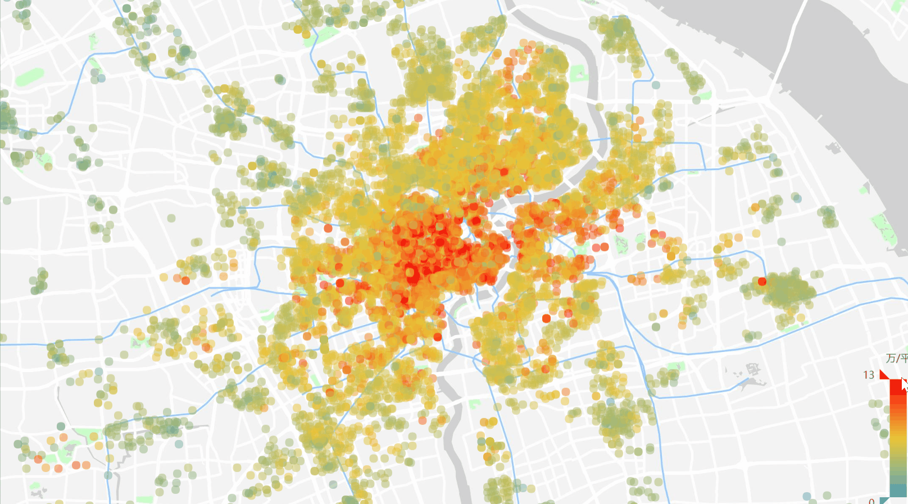

# 上海房价地图

### 介绍
显示上海各小区二手房均价，数据来源[链家](https://sh.lianjia.com/xiaoqu/)，时间截至2018年7月

### 安装
[Python3](http://www.runoob.com/python/python-install.html)

### 运行
[演示页面](https://springga.github.io/shanghai-houseprice/xiaoqu.html)

或者本地运行：python serve.py

### 效果

### 其他
抓取链家小区数据的脚本以及数据的处理[xiaoqu.ipynb](xiaoqu.ipynb)

